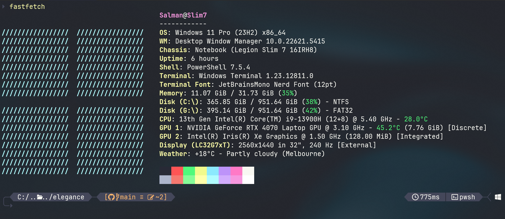

# elegance 🎴

The elegance theme for [Oh My Posh](https://ohmyposh.dev/) strikes the perfect balance between functionality and style. It provides a clean, sophisticated and informative prompt for those who value simplicity and clean lines.

By default, elegance uses the custom **Silvermist** color palette, but it is designed to be easily customised with other palettes.

## Features

* **Git Integration:** Shows current branch, upstream status, and file changes (working, staging).
* **Path Display:** Displays the current working directory in a shortened format.
* **Language Runtimes:** Detects and displays version information for:
    * R
    * Python
    * Node.js
* **Execution Time:** Shows the execution time of the last command.
* **Shell Information:** Displays the current shell in use.
* **OS Indicator:** Shows an icon for your current operating system.
* **Admin/Root Indicator:** Clearly indicates if you are running as a root user.

## Screenshots

### Silvermist Palette (Default)


### Dracula Palette




## Installation

1.  Ensure you have Oh My Posh installed and configured for your shell.
2.  Download the `elegance.omp.json` theme file.
3.  Move the theme file to your Oh My Posh themes directory (or any location you reference in your shell profile).
4.  Update your shell profile (`$PROFILE` for PowerShell, `.bashrc`, `.zshrc`, etc.) to use the theme:

    ```sh
    oh-my-posh init pwsh --config /path/to/elegance.omp.json | Invoke-Expression
    ```

## Configuration: Palettes

The elegance theme uses a self-contained `palette` block within the `elegance.omp.json` file. This makes switching themes simple, as you do not need to edit any other part of the theme.

The default elegance palette is **Silvermist**.

### Using an Alternative Palette

This repository provides alternative palettes in the `palette/` directory. To use one, simply copy the entire JSON content from the desired palette file (e.g., `dracula-oh_my_posh.json`) and paste it over the `palette` block in your `elegance.omp.json` theme file.

### Matching Terminal Themes

For the best experience, use the accompanying terminal color schemes.

To add the themes to Windows Terminal:
* Open your Windows Terminal Settings (Ctrl + ,).
* Click Open JSON file.
* Scroll down to the schemes array.
* Copy and paste the relevant JSON objects in `palette/` into the schemes array.
* Save the file and apply the new scheme (e.g., "Silvermist" or "Dracula") in your terminal's appearance settings.

## Licence

This project is licensed under the MIT License - see the [LICENSE](LICENSE) file for details.