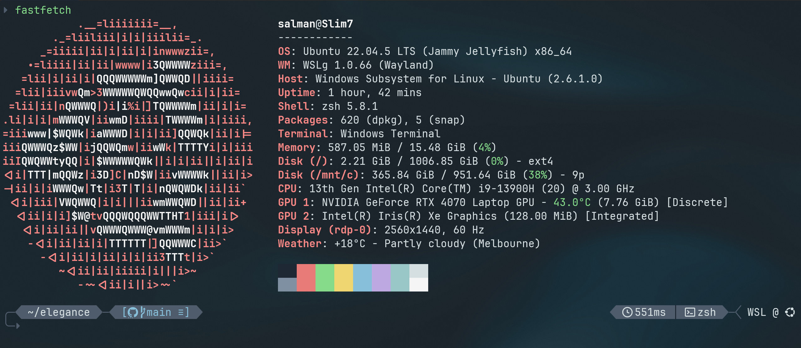

# elegance 🎴

The elegance theme for [Oh My Posh](https://ohmyposh.dev/) strikes the perfect balance between functionality and style. It provides a clean, sophisticated and informative prompt for those who value simplicity and clean lines.

By default, elegance uses the **Silvermist** color palette, but it also supports alternative palettes to suit your personal taste.

## Features

- Two-Line Display: A clean layout that separates the  command input from the informational segments.
- Transient Prompt: Replaces the detailed prompt with a simple › after each command, keeping terminal history clean and readable.
- Detailed Git Integration:
  - Dynamically changes color to reflect repo status (clean, modified, or diverged)
  - Displays the current branch, upstream icon, and counts for staged, modified and stashed files
- Right-Aligned Contextual Info: Shows "at-a-glance" information on the right side, including:
  - Operating System icon (with WSL detection)
  - Current shell (e.g. pwsh, bash)
  - Last command execution time
- Developer-Friendly Segments: Automatically displays version information when in a project folder for:
  - R
  - Python (including virtual environment)
  - Node.js (with npm/yarn icon)
- Status Indicators for Common Scenarios:
  - Error - The input prompt marker turns red if the last command failed
  - Administrator - ⚡︎ icon appears when running as root or with elevated privileges

## Screenshots

### Silvermist Palette (Default)



### Dracula Palette


## Installation

1.  Ensure you have Oh My Posh installed and configured for your shell.
2.  Download the `elegance.omp.json` theme file.
3.  Move the theme file to your Oh My Posh themes directory (or any location you reference in your shell profile).
4.  Update your shell profile (`$PROFILE` for PowerShell, `.bashrc`, `.zshrc`, etc.) to use the theme:

    ```sh
    # OhMyPosh Remote (synced)
    oh-my-posh init pwsh --config 'https://raw.githubusercontent.com/salmanjt/elegance/main/elegance.omp.json' | Invoke-Expression

    # OhMyPosh (local/faster)
    oh-my-posh init pwsh --config /path/to/elegance.omp.json | Invoke-Expression
    ```

## Configuration

#### Using an Alternative Palette

The elegance theme uses a self-contained `palette` block within the `elegance.omp.json` file. This makes switching themes simple, as you do not need to edit any other part of the theme.

This repository provides alternative palettes in the `palette/` directory. To use one, simply copy the entire JSON content from the desired palette file (e.g., `dracula-oh_my_posh.json`) and paste it over the `palette` block in your `elegance.omp.json` theme file.

#### Matching Terminal Themes

For the best experience, use the accompanying terminal color schemes.

To add the themes to Windows Terminal:
- Open your Windows Terminal Settings (Ctrl + ,).
- Click Open JSON file.
- Scroll down to the schemes array.
- Copy and paste the relevant JSON objects in `palette/` into the schemes array.
- Save the file and apply the new scheme (e.g., "Silvermist" or "Dracula") in your terminal's appearance settings.

## Licence

This project is licensed under the MIT License - see the [LICENSE](LICENSE) file for details.